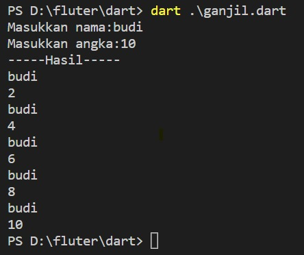
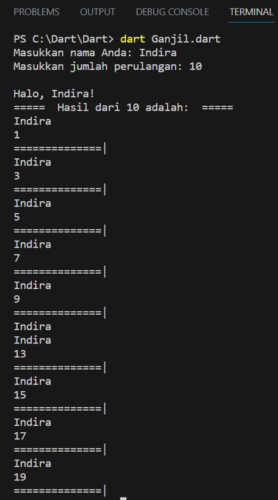
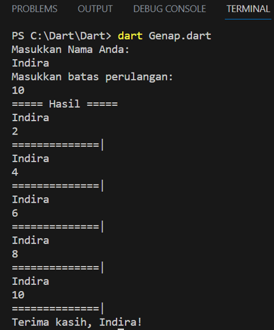

| Name    | Indira Aline |
| ------- | ----------- |
| NIM     | 312010042       |
| Class   | TI.20.A.1        |
| Mata Kuliah   | Pemrograman Mobile  |
| Dosen  | Muhammad Najamuddin Dwi Miharja, S.Kom, M.kom  |

## Calculate and display the name and value of a number loop </p> </br>

Task: </p></br>
</p> </br>

1. Odd Number Loop Name and Value </p></br>
<li> Source Code: </p></br> </li>

``` dart
import 'dart:io';
void main() {
  stdout.write("Masukkan nama Anda: ");
  String nama = stdin.readLineSync()!;
  stdout.write("Masukkan jumlah perulangan: ");
  int jumlahPerulangan = int.parse(stdin.readLineSync()!);
  print("\nHalo, $nama!");
  print("=====  Hasil dari $jumlahPerulangan adalah:  ===== ");
  int count = 1;
  int number = 1;
  while (count <= jumlahPerulangan) {
    if (number % 2 != 0) {
      print(nama);
      print(number);
      print("==============|");
      count++;
      
    }
    number++;
    
  }
}
```
</p></br>

<li> Explanation of code above: </li></p>

1. Import 'dart:io':
   Baris pertama pada kode tersebut mengimpor pustaka dart:io, yang digunakan untuk berinteraksi dengan input/output (I/O) di dalam program.

2. void main():
   Fungsi utama yang akan dieksekusi ketika program dijalankan.

3. stdout.write("Masukkan nama Anda: ");
   Mengeluarkan prompt ke terminal untuk meminta pengguna memasukkan nama. stdout.write digunakan untuk menampilkan teks tanpa garis baru di akhirnya.

4. String nama = stdin.readLineSync()!;
   Membaca input dari pengguna yang merupakan nama, menggunakan stdin.readLineSync(). Input tersebut disimpan dalam variabel "nama" yang memiliki tipe data String. Tanda seru (!) menandakan bahwa variabel "nama" tidak boleh bernilai null.

5. stdout.write("Masukkan jumlah perulangan: ");
   Mengeluarkan prompt ke terminal untuk meminta pengguna memasukkan jumlah perulangan.

6. int jumlahPerulangan = int.parse(stdin.readLineSync()!);
   Membaca input dari pengguna yang merupakan jumlah perulangan yang diinginkan. stdin.readLineSync() digunakan untuk membaca input sebagai String, kemudian fungsi int.parse() digunakan untuk mengonversi String menjadi bilangan bulat (int). Input tersebut disimpan dalam variabel "jumlahPerulangan" yang memiliki tipe data int. Tanda seru (!) menandakan bahwa variabel "jumlahPerulangan" tidak boleh bernilai null.

7. print("\nHalo, $nama!");
   Menampilkan pesan sambutan yang mengandung nama pengguna yang dimasukkan oleh pengguna.

8. print("=====  Hasil dari $jumlahPerulangan adalah:  ===== ");
   Menampilkan header yang menggambarkan bahwa output berikutnya adalah hasil dari jumlah perulangan.

9. int count = 1;
   Variabel "count" diinisialisasi dengan nilai 1. Variabel ini akan digunakan untuk menghitung jumlah perulangan.

10. int number = 1;
    Variabel "number" diinisialisasi dengan nilai 1. Variabel ini akan digunakan untuk menyimpan angka yang akan ditampilkan.

11. while (count <= jumlahPerulangan) {
    while-loop akan terus dijalankan selama nilai "count" masih kurang dari atau sama dengan "jumlahPerulangan".
       
12. if (number % 2 != 0) {
    Pernyataan ini memeriksa apakah "number" adalah bilangan ganjil. Jika benar, maka blok kode di dalamnya akan dijalankan.

13. print(nama);
    Menampilkan nama pengguna.

14. print(number);
    Menampilkan nilai "number".

15. print("==============|");
    Menampilkan garis pemisah.

16. count++;
    Meningkatkan nilai "count" sebesar 1 untuk menghitung jumlah perulangan.
      
17. number++;
    Meningkatkan nilai "number" sebesar 1 untuk memperoleh angka selanjutnya dalam deret.

18. }
    Tutup blok while-loop.
</br></p>

Output:



2. Name and Value of Even Number Loop </p></br>
<li> Source Code: </p></br> </li>

``` dart
import 'dart:io';

void main() {
  print('Masukkan Nama Anda:');
  String nama = stdin.readLineSync()!;

  print('Masukkan batas perulangan:');
  int batas = int.parse(stdin.readLineSync()!);

  print("===== Hasil =====");

  for (int i = 1; i <= batas; i++) {
    if (i % 2 == 0) {
      print(nama);
      print(i);
      print("==============|");
    }
  }

  print('Terima kasih, $nama!');
}

</br></p>

<li> Explanation of code above: </li></p>

1. Import 'dart:io':
   Baris pertama pada kode tersebut mengimpor pustaka dart:io, yang digunakan untuk berinteraksi dengan input/output (I/O) di dalam program.

2. void main():
   Fungsi utama yang akan dieksekusi ketika program dijalankan.

3. print('Masukkan Nama Anda:');
   Menampilkan pesan ke layar untuk meminta pengguna memasukkan nama.

4. String nama = stdin.readLineSync()!;
   Membaca input dari pengguna yang merupakan nama, menggunakan stdin.readLineSync(). Input tersebut disimpan dalam variabel "nama" yang memiliki tipe data String. Tanda seru (!) menandakan bahwa variabel "nama" tidak boleh bernilai null.

5. print('Masukkan batas perulangan:');
   Menampilkan pesan ke layar untuk meminta pengguna memasukkan batas perulangan.

6. int batas = int.parse(stdin.readLineSync()!);
   Membaca input dari pengguna yang merupakan batas perulangan yang diinginkan. stdin.readLineSync() digunakan untuk membaca input sebagai String, kemudian fungsi int.parse() digunakan untuk mengonversi String menjadi bilangan bulat (int). Input tersebut disimpan dalam variabel "batas" yang memiliki tipe data int. Tanda seru (!) menandakan bahwa variabel "batas" tidak boleh bernilai null.

7. print("===== Hasil =====");
   Menampilkan header yang menggambarkan bahwa output berikutnya adalah hasil perulangan.

8. for (int i = 1; i <= batas; i++) {
    for-loop akan terus berjalan selama nilai "i" masih kurang dari atau sama dengan "batas". Variabel "i" diinisialisasi dengan nilai 1 dan akan bertambah 1 setiap iterasi.

9. if (i % 2 == 0) {
    Pernyataan ini memeriksa apakah "i" adalah bilangan genap. Jika benar, maka blok kode di dalamnya akan dijalankan.

10. print(nama);
    Menampilkan nama pengguna.

11. print(i);
    Menampilkan nilai "i" yang merupakan bilangan genap.

12. print("==============|");
    Menampilkan garis pemisah.

13. }
    Tutup blok for-loop.

14. print('Terima kasih, $nama!');
    Menampilkan pesan terima kasih kepada pengguna dengan menyertakan nama pengguna yang dimasukkan.

</p></br>

Output:
